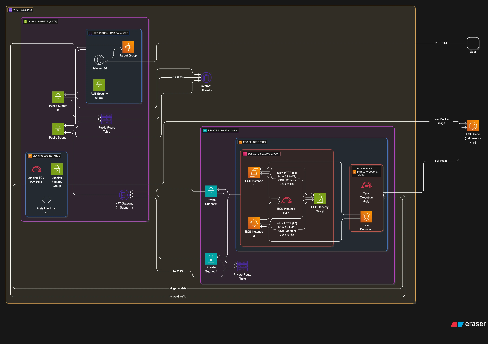

# 📦 ECS-Jenkins Hello World App (EC2 Launch Type)

This project provisions an **ECS Cluster (EC2 launch type)** that runs a **Dockerized Python app** with full CI/CD automation using **Jenkins**, **Terraform**, and **AWS ECS**.

---

## 🧰 Tech Stack

- ⚙️ **Terraform** – Infrastructure as Code
- 🐳 **Docker** – App containerization
- 🚀 **Amazon ECS (EC2)** – Container orchestration
- 📦 **Amazon ECR** – Image storage
- 🔧 **Application Load Balancer (ALB)** – Routing
- 🤖 **Jenkins** – CI/CD automation

---

## 🏗️ Architecture



---

## 🔧 AWS Services Used

| Service                      | Purpose                                                                 |
|------------------------------|-------------------------------------------------------------------------|
| **EC2**                      | Hosts Jenkins for running the CI/CD pipeline                            |
| **ECS (EC2 Launch Type)**    | Runs the Dockerized application as a container                          |
| **ECR (Elastic Container Registry)** | Stores Docker images built by Jenkins                                 |
| **ALB (Application Load Balancer)** | Routes incoming traffic to the ECS service                             |
| **IAM**                      | Grants permissions to EC2, ECS, and Jenkins to interact with AWS safely |
| **VPC**                      | Provides networking layer (subnets, IGW, routing)                        |
| **Auto Scaling Group (ASG)** | Ensures ECS container instances are available and scalable              |

---

## 🏗️ Architecture Explained

### 1. Infrastructure Provisioning (via Terraform)

Your modularized Terraform setup provisions all the components needed to host your containerized app:

- **VPC Module** – Creates subnets, internet gateway, routing
- **Security Groups (SG)** – Opens necessary ports (e.g., 80, 8080, 22)
- **IAM Module** – Creates IAM roles for EC2 and ECS
- **Jenkins EC2 Module** – Launches an EC2 instance with Jenkins installed
- **ECR Module** – Creates a private Docker image repository
- **ECS Module** – Provisions an ECS cluster using EC2 launch type
- **ECS Instances Module** – Launch templates + ASG for ECS container instances
- **ALB Module** – Creates an ALB to route traffic to the ECS service

---

### 2. CI/CD Workflow (via Jenkins Pipeline)

1. Developer pushes code to GitHub
2. Jenkins (on EC2) detects the change
3. Jenkins pipeline:
   - Clones the repo
   - Builds Docker image from `hello-world-app/Dockerfile`
   - Tags and pushes image to ECR
   - Triggers ECS service update via `aws ecs update-service`
4. ECS service pulls the new image and deploys
5. ALB routes user traffic to the new ECS task

---

### 🌐 Access Flow

```
[User] → [ALB] → [ECS Service] → [Dockerized App in EC2 Container Instance]
```

---

## 🔨 Key Components

- **Terraform Modules**:
  - VPC, ECS Cluster, ALB, IAM, ASG
- **hello-world-app/**:
  - Python app, Dockerfile, Jenkinsfile
- **Jenkins Pipeline**:
  - Clones repo → Builds image → Pushes to ECR → Updates ECS

---

## 🚀 How to Deploy

```bash
git clone https://github.com/alinaleem/ecs-jenkins.git
cd ecs-jenkins
terraform init
terraform apply -auto-approve
```

> Output will include your ALB DNS URL

---

## 🌐 Access the App

```bash
curl http://<ALB_DNS>
```

Or open:

```
http://<alb-dns>.amazonaws.com
```

---

## 🔄 CI/CD Flow

1. Jenkins clones the GitHub repo
2. Builds & tags Docker image
3. Pushes to Amazon ECR
4. Updates ECS Service using `aws ecs update-service`

---

## 🧹 Teardown

```bash
terraform destroy -auto-approve
```

---

## 🙋‍♂️ Author

Made with ❤️ by [@alinaleem](https://github.com/alinaleem)  
Let’s connect on [LinkedIn](https://linkedin.com/in/alinaleem)
